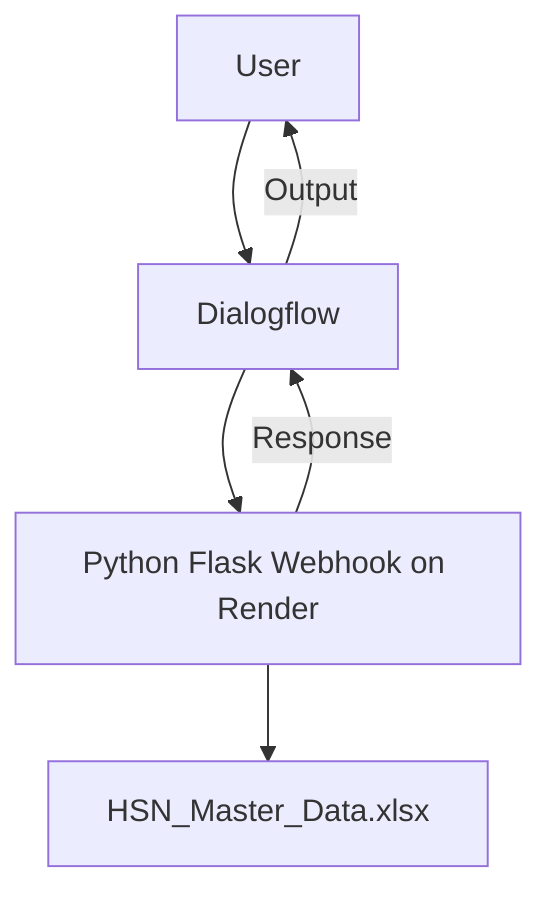

# ✅ HSN Code Validation Agent using Google ADK (Dialogflow + Python Flask, Render Deployment)

A smart chatbot agent built with **Google Dialogflow (ADK)** and **Python Flask**, deployed using **Render**, which validates HSN (Harmonized System of Nomenclature) codes using an Excel master dataset.

---

## 📌 Features

✅ Validates HSN codes (2 to 8 digits) from Excel master data  
✅ Returns product description if valid  
✅ Provides error messages for invalid format or non-existent codes  
✅ Fully integrated with Dialogflow (acts as an intelligent agent)  
✅ Hosted for free using Render (works even behind firewalls)

---

## 🖥 Technologies Used

- Python 3
- Flask
- Pandas
- OpenPyXL
- Google Dialogflow (ADK concept)
- Render (for deployment)
- GitHub (for version control)

---

## 🚀 Demo Architecture



---

## 🧰 Prerequisites

- Google account (for Dialogflow)
- GitHub account (for Render deployment)
- Python 3.x installed
- Code editor (VS Code, Jupyter, etc.)

Install required libraries:
```bash
pip install pandas flask openpyxl
```

---

## 📁 Project Structure
```
project-folder/
│
├── app.py                  # Flask Webhook Code
├── requirements.txt        # Python Dependencies
├── render.yaml             # Render Deployment Config
├── HSN_Master_Data.xlsx    # Excel with HSN Data
└── README.md               # Documentation
```

---

## 🆙 Step-by-Step Deployment Guide

### 📝 1. Prepare Files
- Make sure all files (`app.py`, `requirements.txt`, `render.yaml`, `HSN_Master_Data.xlsx`) are in your project folder.

### 🧑‍💻 2. Push to GitHub
```bash
git init
git add .
git commit -m "Initial commit"
git branch -M main
git remote add origin https://github.com/YOUR_USERNAME/hsn-validation-agent.git
git push -u origin main
```

### ☁️ 3. Deploy on Render
- Go to https://render.com/
- New → Web Service → Connect your GitHub repo
- Fill settings:
  - Name: `hsn-validator`
  - Runtime: Python
  - Start Command: `python app.py`
- Click "Create Web Service"

Webhook URL will look like:
```
https://hsn-validator.onrender.com/webhook
```

### 🔗 4. Connect to Dialogflow
- Go to Dialogflow Agent
- Click Fulfillment → Enable Webhook
- Paste the Render webhook URL and save
- In the intent, enable webhook call

---

## 🧪 Test it Live

Type in Dialogflow test console:
```
Check HSN 0101
```
Response:
```
✅ HSN Code 0101 is valid.
Description: LIVE HORSES, ASSES, MULES AND HINNIES.
```

---


## 🏁 Final Notes

✅ Easy to integrate into existing systems  
✅ Can be extended to SAC codes or descriptions  
✅ Fully ADK-aligned (Google Dialogflow framework)  
✅ Ready for presentation and interview/demo use

---

## 🧠 Credits
Built by KATHIRAVAN  as part of a Smart Agent Assessment Project using Google ADK & Python.


---

> 💬 Need help? Raise an issue or email me at pgullu2000@gmail.com
